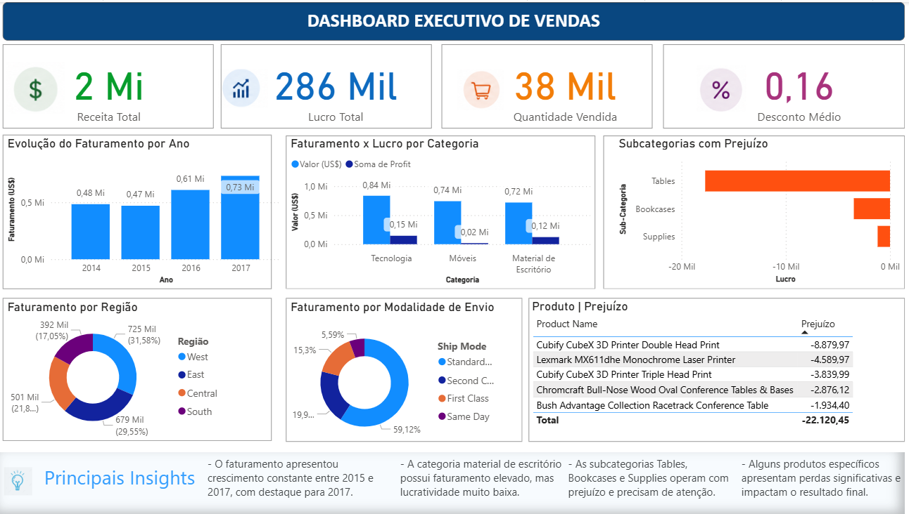

# 📊 Dashboard Executivo de Vendas

Projeto de análise de dados desenvolvido em Power BI, com foco na análise de vendas, faturamento, lucratividade e identificação de pontos de atenção para o negócio.

## 🎯 Objetivo

Transformar uma base de dados de vendas em informações visuais que permitam analisar o desempenho comercial e identificar oportunidades e problemas relacionados a faturamento, lucro, produtos, categorias, regiões e modalidades de envio.

## 🛠️ Ferramentas utilizadas

- **Power BI** — criação do dashboard e visualizações
- **Power Query** — tratamento e transformação dos dados
- **DAX** — criação de medidas e indicadores
- **GitHub** — documentação e organização do projeto

## 🧹 Tratamento e preparação dos dados

Antes da construção do dashboard, foi realizada uma etapa de análise e validação da base de dados.

Durante o processo, foi identificada uma inconsistência na interpretação de valores financeiros, que estava impactando a apresentação de métricas como **Sales, Profit e Discount**.

O problema foi investigado e corrigido utilizando o **Power Query**, com o ajuste adequado dos dados e posterior validação dos resultados.

Essa etapa reforçou a importância de validar a qualidade e a consistência dos dados antes da criação dos indicadores e visualizações.

## 📌 Indicadores analisados

O dashboard apresenta os seguintes KPIs:

- Receita Total
- Lucro Total
- Quantidade Vendida
- Desconto Médio

Além dos indicadores principais, foram realizadas análises de:

- Evolução do faturamento por ano
- Faturamento e lucro por categoria
- Subcategorias com prejuízo
- Faturamento por região
- Faturamento por modalidade de envio
- Top 5 produtos com maior prejuízo

## 🔎 Principais Insights

### 📈 Evolução do faturamento

O faturamento apresentou crescimento ao longo do período analisado, com destaque para **2017**, que apresentou o maior faturamento entre os anos disponíveis na base.

### 💰 Faturamento x Lucratividade

A categoria **Tecnologia** apresentou o maior faturamento e também o maior lucro entre as categorias analisadas.

A categoria Material de Escritório apresentou faturamento elevado, porém com uma lucratividade proporcionalmente menor.

### ⚠️ Subcategorias com prejuízo

A análise identificou subcategorias com resultado negativo, com destaque para **Tables**, que apresentou o maior prejuízo.

Esse resultado indica a necessidade de investigar fatores como descontos, custos, preços praticados e composição dos produtos.

### 🔴 Produtos com maior prejuízo

A análise dos cinco produtos com maior prejuízo identificou aproximadamente US$ 22,1 mil em perdas.

Esse resultado permite direcionar uma investigação mais específica sobre os produtos que apresentam maior impacto negativo na rentabilidade.

## 💻 Desafios e soluções

### Tratamento dos dados

Durante a análise, foi identificada uma inconsistência na interpretação dos valores financeiros.

A solução foi realizada no **Power Query**, ajustando os dados e validando novamente os resultados antes de continuar a construção do dashboard.

### Top 5 produtos com prejuízo

Inicialmente, foi utilizado o recurso de filtro **Top N** do Power BI. Porém, o resultado não atendia ao objetivo esperado.

Para solucionar o problema, foi criada uma medida em **DAX utilizando `RANKX`**, permitindo classificar os produtos de acordo com o lucro e identificar dinamicamente os cinco produtos com maior prejuízo.

## 📊 Dashboard



## 💡 Aprendizados

Este projeto reforçou a importância de analisar e validar os dados antes de iniciar a construção de um dashboard.

Durante o desenvolvimento, foi necessário identificar inconsistências, investigar suas causas, realizar o tratamento no Power Query e validar novamente os indicadores.

Também foram praticados conceitos importantes de:

- Tratamento e preparação de dados
- Power Query
- DAX
- Criação de medidas
- KPIs
- Análise exploratória
- Visualização de dados
- Ranking com `RANKX`
- Identificação de problemas de negócio
- Comunicação de insights através de dashboards

## 📁 Estrutura do projeto

```text
dashboard-vendas-powerbi/
│
├── README.md
├── Dashboard-vendas.png
├── Dashboard-Vendas.pbix
└── Dados/
    └── Sample - Superstore.csv

## 👤 Autor

**Rodrigo Alves**

Projeto desenvolvido como parte do meu portfólio de **Análise de Dados**, com foco no desenvolvimento de habilidades em Power BI, tratamento de dados, DAX e análise de indicadores de negócio.
